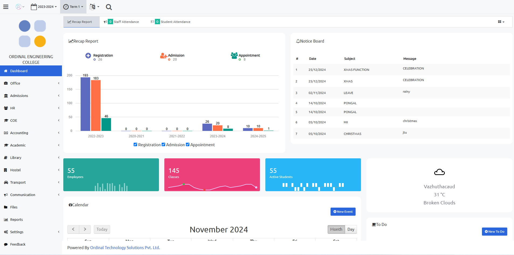
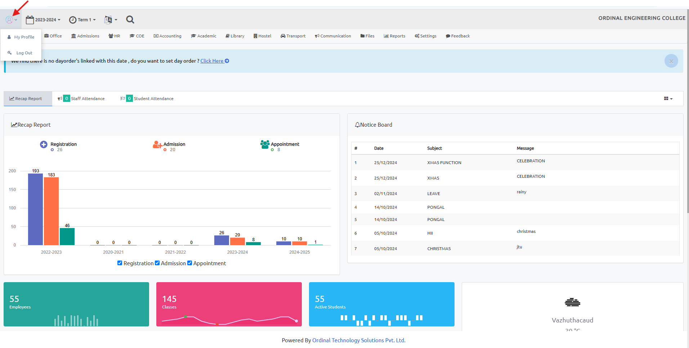

# DASHBOARD

The Dashboard serves as the central hub for navigating and managing key functionalities. Here’s an overview of its components:

> My Profile

* Add Photo: Personalize your profile by uploading a photo. Click on “My Profile” and select the option to add or change your profile picture.

* Change Password : Update your account password for security. Click on “My Profile” and select “Change Password” to set a new password.

*Logout : Securely log out of your account by clicking the “Logout” button.

