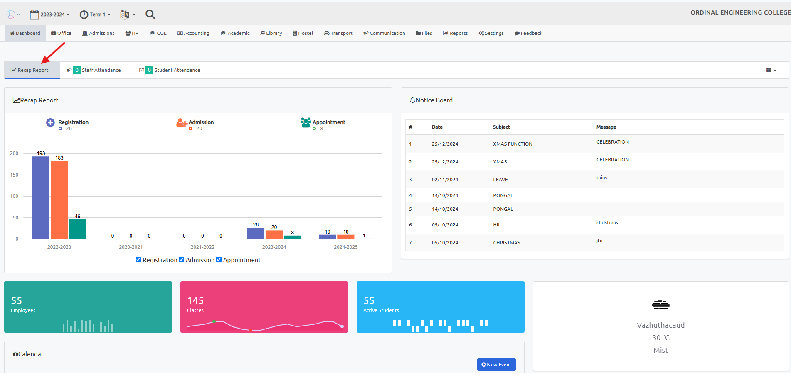

# Recap Report

The Recap Report provides a comprehensive visual summary of key metrics across different years. This feature helps administrators and stakeholders track trends and make informed decisions.

## Features

### 1. Year-wise Graphs

- **Student Registration:** Visual representation of the number of student registrations each year.

- **Admissions:** Graph showing the annual admission trends, helping to analyze growth patterns.

- **Employee Appointments:** Overview of new employee appointments year by year, providing insights into staffing trends.

This tool allows for easy monitoring and comparison, making it a valuable resource for strategic planning and analysis.