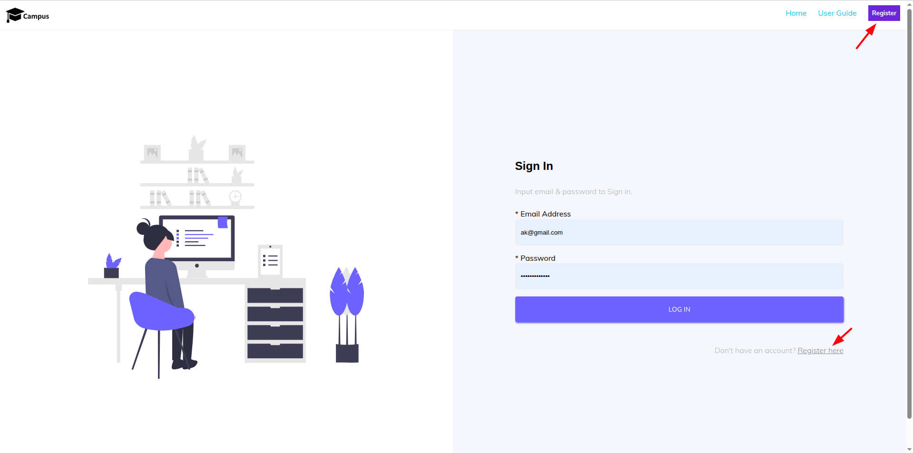

# Initialization Setup

- **Register an Account** → Sign up on the ERP website using your campus/organization credentials.
- **Login & Access Modules** → Log in and start using available ERP features such as student & teacher records, courses, attendance, etc.

## Registration

### Registration Options

#### 1. Register (Top Right Button)

- **Location:** Top navigation bar, right side
- **Action:** Redirects the user to the registration page.

#### 2. Register Here (Bottom Link)

- **Location:** Below the Sign In form
- **Action:** Provides a quick link for new users to register.

---

**Path:** `Login page → Register page`

